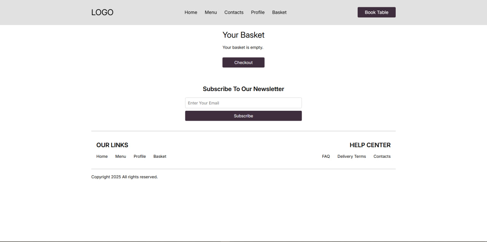

# Restaurant Management System

This project is a **Restaurant Management System** built with Django, designed to streamline the operations of a restaurant by managing menus, orders, and customer interactions.

## Features

- **Menu Management**: Create, update, and organize menu items with categories and pricing.
- **Order Processing**: Handle customer orders efficiently, track order status, and manage payments.
- **Customer Management**: Maintain customer information and order history to enhance service quality.
- **Responsive Design**: Ensure seamless access across various devices, including desktops, tablets, and smartphones.

## Installation

To set up the project locally, follow these steps:

1. **Clone the repository**:

   ```bash
   git clone https://github.com/Fialex1212/restaurant.git
   cd restaurant
   ```

2. **Create and activate a virtual environment**:

   ```bash
   python3 -m venv env
   source env/bin/activate  # On Windows, use `env\Scripts\activate`
   ```

3. **Install the required dependencies**:

   ```bash
   pip install -r requirements.txt
   ```

4. **Apply migrations to set up the database**:

   ```bash
   python manage.py migrate
   ```

5. **Create a superuser to access the admin panel**:

   ```bash
   python manage.py createsuperuser
   ```

6. **Run the development server**:

   ```bash
   python manage.py runserver
   ```

   Access the application at `http://127.0.0.1:8000/` and the admin panel at `http://127.0.0.1:8000/admin/`.

## Docker Deployment

To deploy the application using Docker:

1. **Build and run the Docker image**:

   ```bash
   docker-compose up --build .
   ```

   The application will be available at `http://localhost:8000/` or `http://127.0.0.1:8000/`.

## Project Structure

The project's structure is as follows:

```
restaurant/
├── app/
│   ├── migrations/
│   ├── static/
│   ├── templates/
│   ├── __init__.py
│   ├── admin.py
│   ├── apps.py
│   ├── models.py
│   ├── tests.py
│   └── views.py
├── media/
│   └── uploads/
│       └── dishes/
├── restaurant/
│   ├── __init__.py
│   ├── asgi.py
│   ├── settings.py
│   ├── urls.py
│   └── wsgi.py
├── .env
├── .gitignore
├── Dockerfile
├── docker-compose.yml
├── manage.py
└── requirements.txt
```

## Screenshots

### Home


### Book a table


### Contacts


### Profile


### Basket


### My orders


### Logign


### Register


- `app/`: Contains the core application code, including models, views, templates, and static files.
- `media/`: Houses user-uploaded media, such as images of dishes.
- `restaurant/`: Contains project-level configurations and settings.
- `.env`: Environment variables for configuration.
- `Dockerfile`: Instructions to build the Docker image.
- `docker-compose.yml`: Configuration for Docker Compose to manage multi-container deployments.
- `manage.py`: Command-line utility for administrative tasks.
- `requirements.txt`: List of Python dependencies.

## Contributing

Contributions are welcome! To contribute:

1. Fork the repository.
2. Create a new branch: `git checkout -b feature-name`.
3. Make your changes and commit them: `git commit -m 'Add new feature'`.
4. Push to the branch: `git push origin feature-name`.
5. Submit a pull request detailing your changes.

